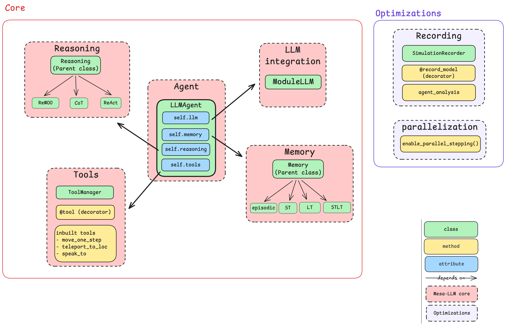

# GSoC final submission [Mesa-LLM](https://github.com/wang-boyu/mesa-llm) (Colin FRISCH GSoC 2025)

## Overview

### Context

[Project MESA](https://github.com/projectmesa/mesa) is an agent-based modeling framework that is easy to use and applicable for a wide range of simulations. But traditional ABM agents rely on simple rules and patterns that are chosen by the users themselves, which can limit their adaptability. 

The main objective of this GSoC project is to develop a well-integrated extension of Mesa that gives agents access to LLMs for reasoning, decision-making, and communication, that can be used not only for simulations, but also as part of a scientific approach to study the impact of different paradigms and reasoning modules in ABM. 

The project was developed by Sanika Nair and myself, and we worked closely together using PRs, code reviews, and discussions to stay on the same page as much as possible.

### General architecture

Mesa-LLM was implemented around a main class, the `LLMAgent`, that is a subclass of the `Agent` class in Mesa, and it is used to create agents that can use LLMs for reasoning, decision-making (including tool calling), and communication. An additional `@record_model` decorator was added to allow for recording of the model's state at each step and store it in a file for later analysis.




## Memory in Mesa-LLM agents

The main feature of LLM agents is that they can base their thoughts and actions on their recollection of previous events. The idea is that the user should be able to fully control how the agent does it. To make it as user friendly as possible, we implemented a unified way to record an event, `MemoryEntry` (a subclass of `dict` used to store the event's information) as well as a base `Memory` class with unifying methods:

```python
class Memory(ABC):
    ...

    @abstractmethod
    def get_prompt_ready(self) -> str: #Get the memory in a format that can be used for reasoning

    @abstractmethod
    def get_communication_history(self) -> str: #Get the communication history in a format that can be used for reasoning

    def add_to_memory(self, type: str, content: dict): #Add an entry to the memory
```

Based on this, the user can either build their own memory structure or use one of the pre-built memory structures that we implemented, including:
- Short term memory `ShortTermMemory`: Purely short-term memory class that remembers only the last n memory entries.
- Long term memory `LongTermMemory`: Purely long-term memory class that tries to store everything the agent experiences with a summarization function (using the LLM).
- Short term / long term memory `STLTMemory`: Hybrid memory class that remembers the last n memory entries and uses the LLM to summarize the long-term memory.
- Episodic memory `EpisodicMemory`: Based on a [Stanford/DeepMind paper](https://arxiv.org/pdf/2304.03442), stores memories based on event importance scoring. 


### Challenges

I did not start right away by implementing a modular parent class for memory. At first, I simply built the `STLTMemory` that I imagined in the GSoC proposal. After discussion with the team, I decided that it would be best to make it more modular. Hence, I tried to adapt the rest of the program so that it would fit in another memory file. But simply including another memory structure would prove to be too complicated without a base structure, which is why we ended up choosing this particular structure.


## Making the LLM agent act

Enabling the agent to decide on its action with the LLM is the heart of the project and unlike the memory module, we planned it from the beginning to be structured as a parent `Reasoning(ABC)` class and child classes that do the planning and help with tool calling as the user designs them.

### Reasoning

In order to ease the implementation of reasoning methods by the user (or simply use one of the inbuilt tools), we implemented two data classes:
- `Observation`: Snapshot of everything the agent can see in this step: attributes are self-state (system prompt, internal state, location, etc.), local state of nearby agents within vision radius, and the current time step.
- `Plan`: LLM-generated plan that can span multiple steps, containing the step when generated, the complete LLM response message object, and a time-to-live parameter for planning frequency.

We also implemented three distinct reasoning paradigms: 
- **Chain-of-Thought (CoT)**: guides agents through structured step-by-step thinking before action execution
- **ReAct (Reason and Act)**: combines reasoning and acting in a more fluid manner by having agents explicitly state their reasoning process alongside their planned actions
- **ReWOO (Reasoning Without Observation)**: creates comprehensive multi-step plans that can be executed over several simulation steps without requiring new environmental observations. 


### Tool calling

We made a `ToolManager` class to be used by the user either as a toolbox, or to separate into different categories for different types of agents. The user can also integrate their own tools by creating a `tools.py` (or any other name) file and using the `@tool` decorator. The main challenge here is the integration of new tools: they must be fully integrated with all the pre-existing code and not be the source of potential errors. To address this, we ask the user to docstring the function in a precise way:

```python
from mesa import Agent
from mesa_llm import tool

@tool
def my_tool(agent : Agent, arg1 : str, arg2 : int):
    """
    Description of the tool

    Args:
        arg1: description of arg 1
        arg2: description of arg 2

    Returns:
        What the function is supposed to return
    """
    ...
    return ...
```

I then wrote a _parse_docstring() function that validates all arguments and types of the decorated tool. The decorator then formats the built tool in a structure compatible with litellm (openai API format) for tool calling. Since in most cases the tool is an action to be done by an agent, the tool needs to be passed an `Agent` argument. However, the LLM cannot pass in an object. The most reliable solution that we found was passing automatically the `Agent` object directly from the ToolManager via the `call_tool` method. Some future work can consist of making some agent-less tools, but right now it can already be done simply by declaring the `agent` parameter without using it.


## Optimizing the extension

At this point, we have a library extension that is usable and fully functional. The two examples (cf. Examples and tests) that we built for demonstration purposes were built and made functional using only this code. However, simulations were quite slow, and despite a lot of text being generated (observations, actions, messages, etc.), closing the terminal meant losing all the data.

### Parallelization

To fix the delay issue, we chose to give an asynchronous option to the user that can now define the step function as asynchronous using `await` when async operations are needed (like `aplan`).

```python
from mesa_llm import LLMAgent

class MyLLMAgent(LLMAgent):
    ...
    async def astep(self):
        plan = await self.reasoning.aplan(
            ...
        )

```

This is the only thing that the user has to do as *parallel_stepping.py* automatically wraps the Mesa `step()` method to make it asynchronous when needed.

### Recording

I also implemented a recording module so that the user can be able to come back to a simulation for further studying the behavior of LLM Agents. I chose to do it in a similar way using:
- A `SimulationRecorder` class that will not be visible or used by the user
- A `@record_model` decorator with two parameters (output_dir and auto_save_interval) that is used like so:

```python
@record_model(output_dir="recordings/", auto_save_interval=100)
        class MyModel(Model):
            ...
```

Once the recording file saved, the user can come back to the simulation for more statistics using the agent_analysis.py file


## Finalization: examples, tests and docs

### Examples

We built two examples to ease the learning curve of a user:
- A "Negotiation Model" that introduces Buyers and Sellers, and makes them interact. The objective is to observe the negotiation capacity of an LLM
- An "Epstein Civil Violence Model", which is the reimplementation of the already existing eponymous model in [Mesa-examples](https://github.com/projectmesa/mesa/tree/main/mesa/examples/advanced/epstein_civil_violence)

The documentation to both of these models are available in the [examples](https://github.com/wang-boyu/mesa-llm/tree/main/examples) part of the mesa-llm repo.

### Tests and docs

Codecov shows a 80%+ coverage, and all tests are up to date. Docs now cover all aspects of mesa-llm

# Conclusion

This experience has been particularly rich for me, as I deepened OOP in Python to depths that I didn't even know existed, and made a fully functional and CI/CD-functional extension of a library in collaboration with another contributor. I'm truly under the impression that once integrated, it could become a widely used part of the Mesa ecosystem and I'm fully ready to keep maintaining it as such.

# Future Work
- Make test coverage for 100% of the code
- Implement agent-less tools functionality
- Enhance performance optimization
- Get real-world feedback from external users

# Links
- We did a written point every week with the mentors to discuss latest implementations, ideas, etc. These meetings and more are accessible via a public [Google Drive](https://drive.google.com/drive/folders/1MnG97U3eJn0NAhNIMbyHEJM5-dZyhJfp)
- Did a few [PRs](https://github.com/wang-boyu/mesa-llm/issues?q=is%3Apr%20author%3A%40me) for stuff that needed feedback and review from mentors and Sanika, but most of my code direectly went through [my commits](https://github.com/wang-boyu/mesa-llm/commits/main/?author=colinfrisch) in this repo.