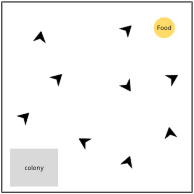
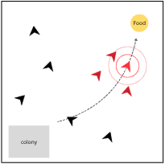

# Foraging Ants Simulation

## Concept
Model a colony of ants searching for food. Each ant uses its memory to remember the locations where food was previously found and is able to transmit the information to the other ants on its path.

## Implementation:

The environment is a continuous grid representing the terrain with scattered food sources (number of food sources : initial_food).​

#### Agents: 
**Ants** : Represented by an arrow, we want to see how much food they can gather. They have a memory capacity to store recent food source locations.​ Ants forget the oldest memories when their memory capacity is exceeded.
**Food** : (allways constant number in the grid). Spawns randomly, is eaten when enough ants gather around it (ants_needed). When eaten, disapears and a new food agent spawns elsewhere.

## Unfolding

The rules of this simulation are made to test the memory module.

By default, ants explore the grid randomly.​ Food is eaten when enough (5 by default) ants are gathered around it.

Upon finding food, the ant (we'll call it Antony) stores the location in their memory, goes to the colony, and comes back to the food following these simple steps :
1. On the way back, the ant transmits the information to all ants physically close to them
> The said ants that are receiving the information head directly to the food and gather all the ants on their path to accompany them to food source
2. When arrived in the colony, Antony heads back to the food source, continuing the transmition of the information to other close by Ants
3. When arrived back at the food source, Antony stays there along with the other ants, as continues transmitting and waiting until enough ants are present and the food is eaten

   

## Technical considerations

Model made to test the Memory feature, it uses :
- memory.remember(entry, entry_type, external(optionnal) )
- memory.get_by_type(entry_type)
- memory.forget(entry_id)
- memory.tell_to(external_agent, entry_id)

Non tested : memory.recall(entry_id)

## Next steps

- Ants can transmit more complex information about the food and adapt

