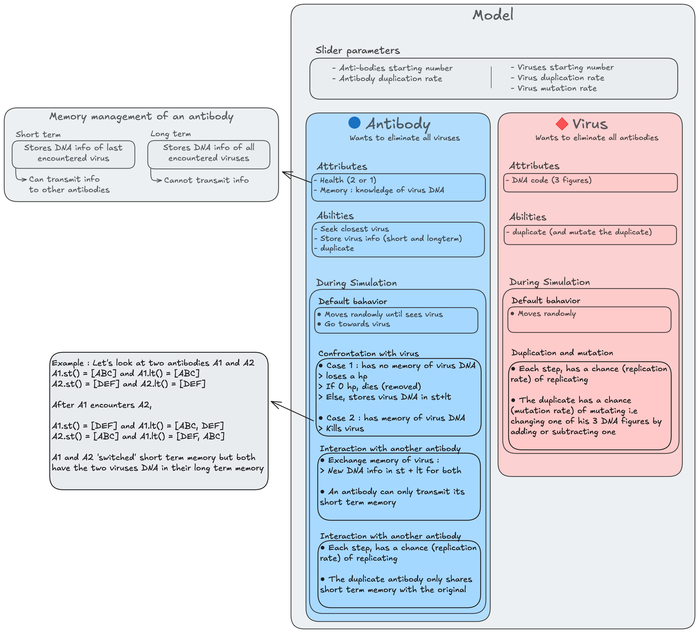

# Virus-Antibody Model

This model is a simulation of immune reaction declined as a confrontationn between antibody agents and virus agents. The results are quite interesting as the simulation can go both ways (virus win or antibodies win) with a little tweak in the base parameters.

For example, with a given set of fixed parameters :
| Virus mutation rate = 0.15 (antibodies win)      | Virus mutation rate = 0.2 (viruses win)          |
|--------------------------------------------------|--------------------------------------------------|
|                    |                       |


The global idea is to model how the imune system can struggle against new virus but is able to adapt over time and beat a same virus if it comes back.


## How It Works

1. **Initialization**: The model initializes a population of viruses and antibodies in a continuous 2D space.
2. **Agent Behavior**:
   - Antibodies move randomly until they detect a virus within their sight range (becomes purple), than pursue the virus.
   - Viruses move randomly and can duplicate or mutate.
3. **Engagement (antibody vs virus)**: When an antibody encounters a virus:
   - If the antibody has the virus's DNA in its memory, it destroys the virus.
   - Otherwise, the virus may defeat the antibody, causing it to lose health or become inactive temporarily.
4. **Duplication**: Antibodies and viruses can duplicate according to their duplication rate.




## Usage

After cloning the repo and installing mesa on pip, run the application with :
```bash
    solara run app.py
```

## A couple more of interesting cases

| An interesting tendency inversion | high duplication + high mutation = both grow (more viruses) | high duplication + low mutation = both grow (more antibodies) |
|---|---|---|
|  |  |  |
